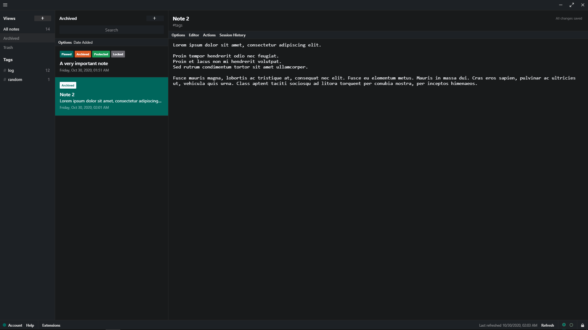
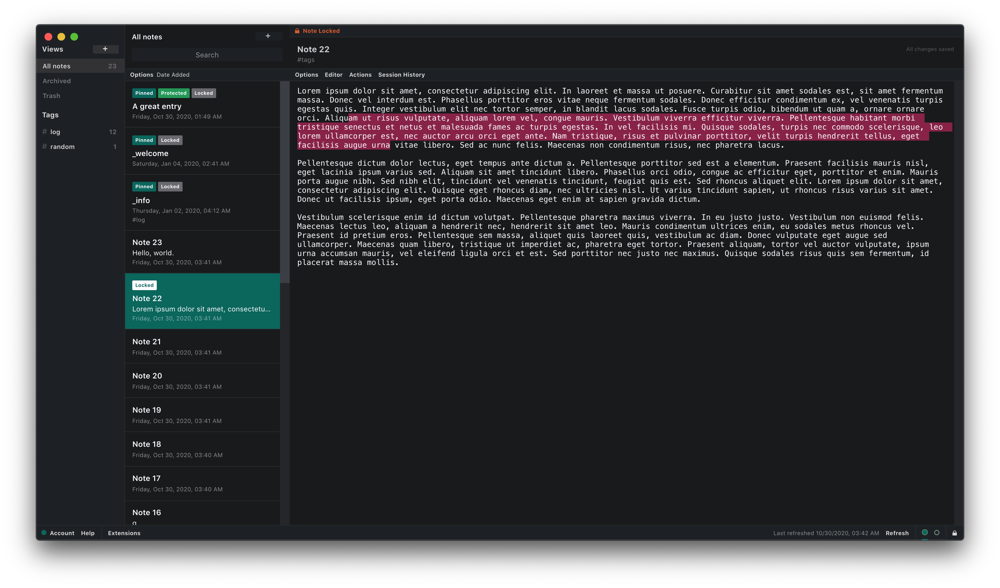
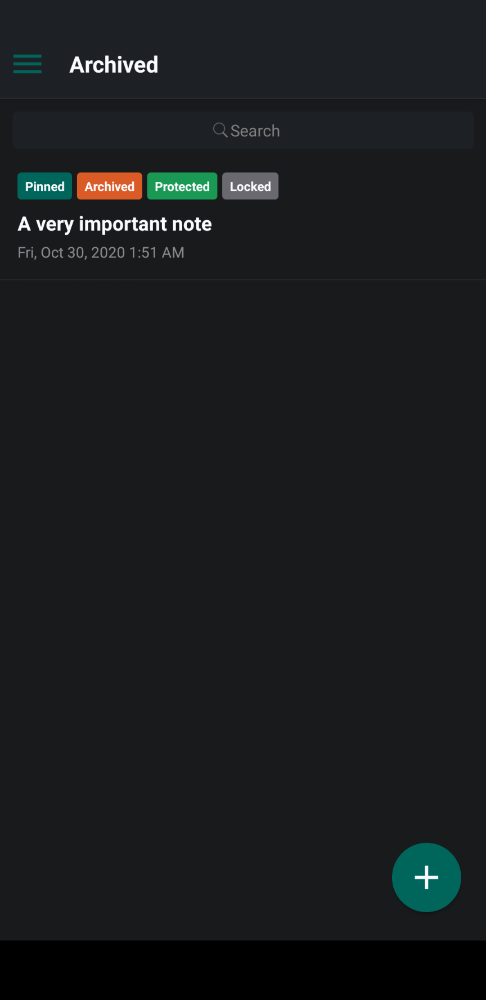
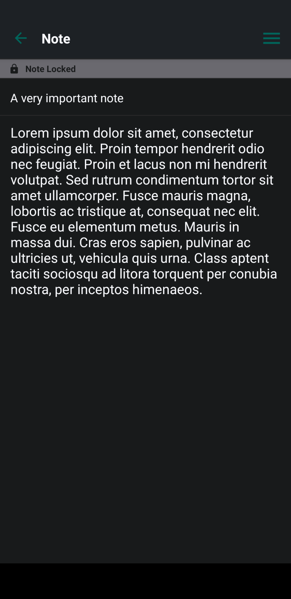

# Dark Theme for Standard Notes

Theme for [Standard Notes](https://standardnotes.org/).

## Installation

On the Desktop app or web-version, open "Extensions" in Standard Notes and click "Import Extension". Enter the following URL as Extension Link and press Enter:

```
https://cabbagecanfly.com/sn-dark-theme/ext.json
```

## Preview

*Last updated screenshots in 30 October 2020. The colours used are unchanged.*

### Windows



### macOS



### Android

  

## Credits

Forked from [christianhans/sn-pure-black-theme](https://github.com/christianhans/sn-pure-black-theme).

Revised by [@CabbageCanFly](https://github.com/CabbageCanFly).
